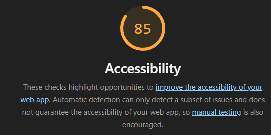

# Q1 : Donner la tailles des fichiers générer par la commande.
Réponse:
Taille : 108.48 kB (2.867 seconds)

# Q2 : Donner la tailles des fichiers générer par la commande.
Réponse:
Taille : 68.21 kB (6.890 seconds)

# Q3 : Est-ce que le fichier est lisible ? Quel est l'intêret de minifier les fichiers d'un point de vue éco-responsable ? Pourquoi on ne minifie pas les fichiers générer en mode dev ?
Réponse:
Le code est illisible, il est très compréssé et rassembler sur quelques lignes.

L'intérêt de la minification est de réduire la taille des fichiers envoyés au navigateur, ce qui va entrainer un temps de chargement + rapide et moins de données transférées sur le réseau et donc une réduction de la consommation des serveurs.
Même si c'est très très peu pour un utilisateur, si on le projette sur un grand nombre, ça a un vrai intérêt.

On ne minifie pas les fichiers en mode devs car on a besoin de maintenir l'application sur le long, et vu que c'est illisible pour un humain, ce n'est pas adapté au besoin.

# Q4 : Donner la taille des fichiers générer par la commande.
Réponse:
50 kb

# Q5: Quel est l'intérêt du HMR ?
Réponse: 

Le HMR permet de mettre à jour automatiquement le navigateur quand on modifie l'application sans recharger la page, ce qui permet de voir directement les modifications sur la page et de garder en mémoire tout ce qu'on a écrit cette page web, comme un nom d'utilisateur/mot de passe ou encore des filtres qu'on a choisit.

# Q6: Donner la tailles des fichiers générer par la commande. Pourquoi il faut être vigilant sur les libraires et autre composant qu'on ajoute dans nos applications d'un point de vue éco-responsable ?
Réponse: 55.5 kb
Les librairies et composants ajoutés augmentent la taille des fichiers de l’application, ce qui fait que l'application consomme plus de bande passante et d’énergie, même si elle est optimisée. Il faut donc prioriser les librairies légères et responsables pour rester éco-responsable.

# Q7: Noter les nom des différents fichiers qui ont été générés par la commande.
Réponse: 
dist/about/index.htm
dist/index.html
style-b4SyXn9O.css
dist/assets/about-D08RWGIN.js
dist/assets/style-Dgd37vtf.js
dist/assets/main-QCVwn2m0.js

# Q8 : Noter les nom des différents fichiers .js qui sont chargés au moment du chargement de la page.
Réponse: 
font-awesome.min.css
main-QCVwn2m0.js
style-Dgd37vtf.js
style-b4SyXn9O.css

# Q9 : Noter les nom des différents fichiers .js qui sont chargés au moment du changement de page.
Réponse:
about-D08RWGIN.js
style-Dgd37vtf.js
style-b4SyXn9O.css

# Q10: Quel est l'intérêt de lu Code Splitting d'un point de vue éco-responsable ?
Réponse:
Le Code Splitting a pour but de charger seulement le code nécessaire pour la page affichée (par exemple Home). Le code de la page About n’est chargé que lorsqu’on clique sur le bouton pour naviguer vers cette page.

# Q11: Ajouter le screen de votre score :
Screen:

# Q12:  Proposition 1
Description:
Nb de requête total du parcours de l'utilisateur:
Taille total des requêtes du parcours de l'utilisateur:
Taille total des fichiers généré :

# Q13:  Proposition 2
Description:
Nb de requête total du parcours de l'utilisateur:
Taille total des requêtes du parcours de l'utilisateur:
Taille total des fichiers généré :

# Q14:  Proposition 3
Description:
Nb de requête total du parcours de l'utilisateur:
Taille total des requêtes du parcours de l'utilisateur:
Taille total des fichiers générés :